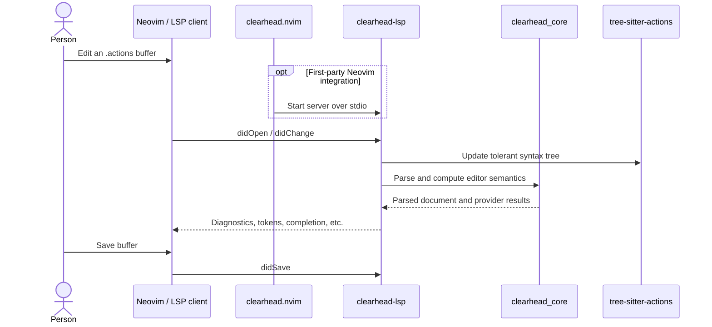
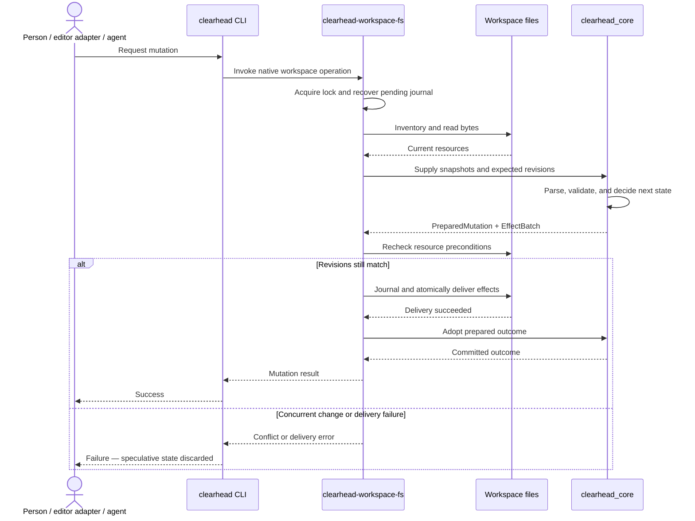
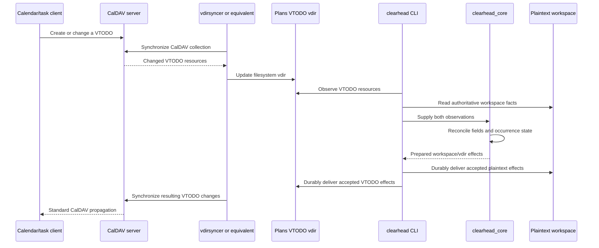
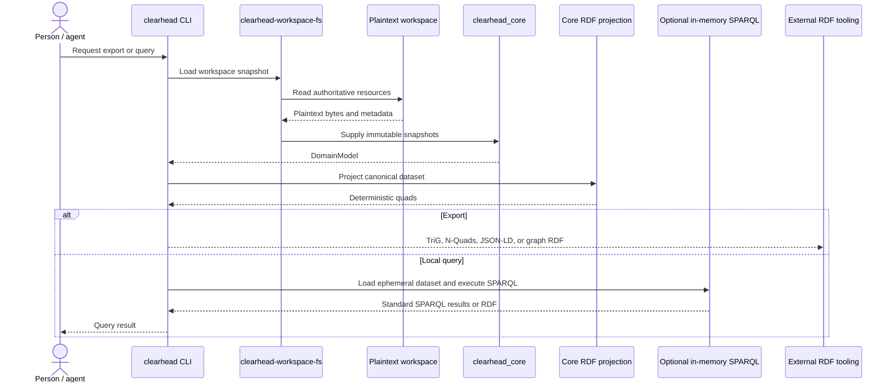

# ClearHead runtime workflows

These Mermaid sequence diagrams describe **event order and information flow**.
They intentionally complement rather than duplicate the
[Structurizr model](../structurizr/README.md): Structurizr arrows mean that the
source is architecturally aware of or depends on the target; arrows here mean
that an interaction happens next and may include responses.

## Edit an action in an LSP client

Neovim is the first-party experience, but the server is not aware of Neovim.
It implements standard LSP for whichever compatible client starts it.

## Deliver a durable mutation

This is the central **Core decides; adapters deliver** round trip.

## Synchronize calendar projections

ClearHead and the CalDAV client are not mutually aware. They coordinate through
a standard VTODO vdir and external synchronization tooling.

## Publish and query RDF

RDF is a deterministic, replaceable projection. Neither the RDF dataset nor the
optional in-memory query engine becomes authoritative.

